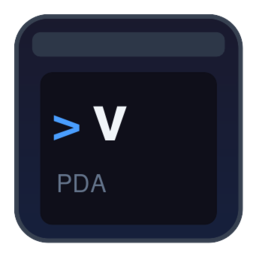
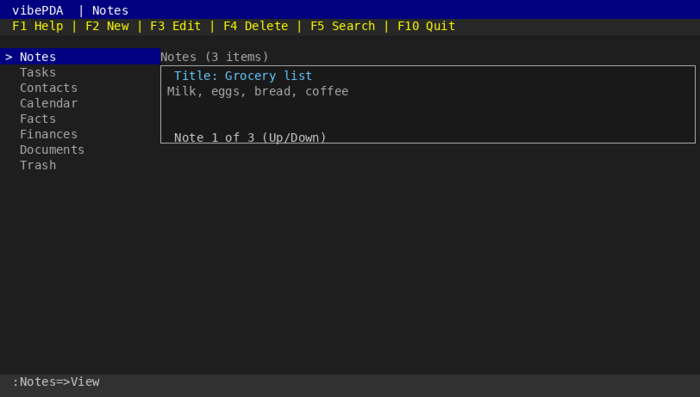
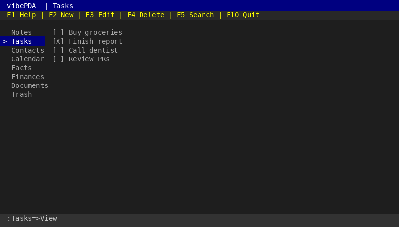
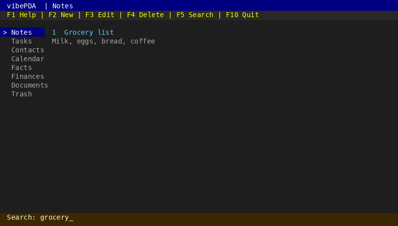
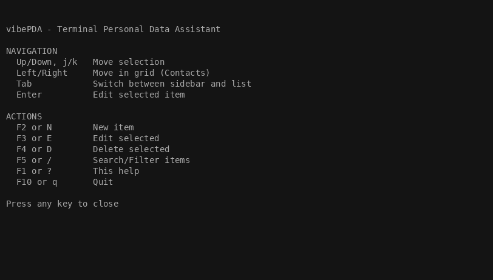

# vibePDA



**A terminal personal data assistant** — Notes, Tasks, Contacts, and Calendar in a single TUI, inspired by classic Outlook.



**Status:** Alpha. Core TUI, storage, and CRUD are in place; polish and full feature parity are ongoing.

**C** implementation with three build targets: **1) Linux**, **2) FreeDOS** (DJGPP), **3) WebAssembly** (Emscripten). Uses **curses** (ncurses on Linux, PDCurses on DOS). Terminal: VT102 minimum; on Linux, modern terminal standards (e.g. SGR, 256 colors) may be used. File-based storage on all platforms (no SQLite).

**📖 [User Manual](docs/USER_MANUAL.md)** — Comprehensive guide with detailed instructions for all features.

---

## Features

| Module    | Description                 |
|-----------|-----------------------------|
| **Notes** | Scratchpad and quick notes  |
| **Tasks** | To-do list                  |
| **Contacts** | Contact list (business card view) |
| **Calendar** | Events and appointments |
| **Facts** | Key-value pairs (e.g. SSN, passwords) |
| **Finances** | General ledger (stub) |
| **Documents** | Templated forms (stub) |
| **Trash** | Soft-deleted items, restore, permanent delete |

- **1980s-style TUI**: Menu bar (F1–F5, F10), status line. Uses curses (ncurses/PDCurses). Box-drawing characters (┌ ─ ┐ │ ├ ┤ └ ┘) for card borders.
- **Note cards**: Notes display as cards (Title + Content); Up/Down navigate between them.
- **Contact cards**: Contacts display as business cards (name, email, phone, notes); Up/Down navigate.

| Notes | Tasks | Search | Help |
|:-----:|:-----:|:------:|:----:|
| [](docs/images/notes.png) | [](docs/images/tasks.png) | [](docs/images/search.png) | [](docs/images/help.png) |
- **Multi-line content editor**: Note body uses a bordered text area with cursor, line numbers (F5), and scrolling (Page Up/Down). Enter=newline, Enter+Enter=save, Esc=cancel.
- **Search/Filter**: Press F5 or / to search/filter items in any module. Filter persists after Enter, press F5 again to clear.
- **Trash management**: Checkbox selection, select all/none, restore, permanent delete with confirmation.
- **Hotkeys**: F2/N new, F3/E edit, F4/D delete, F5/ Search, F1/? help, F10/q quit; Up/Down navigate; Tab switch pane.

---

## Storage

vibePDA uses **binary file-based storage** — no database. One `.bin` file per entity type. Default location: `~/.local/share/vibe` on Linux, or `.` on DOS. Override with `--data-dir`.

**Format**: Length-prefixed strings (4-byte uint32_t) + 4-byte integers. Little-endian. Supports tabs and newlines in data.

| File | Record layout |
|------|---------------|
| `notes.bin` | id(4) + title + content + created_at + deleted_at |
| `tasks.bin` | id(4) + title + done(4) + due_date + priority(4) + created_at + deleted_at |
| `contacts.bin` | id(4) + name + email + phone + notes + created_at + deleted_at |
| `events.bin` | id(4) + title + description + start_at + end_at + all_day(4) + created_at + deleted_at |
| `facts.bin` | id(4) + key + value + created_at + deleted_at |

- **Soft delete**: `deleted_at` empty = active; non-empty = in Trash. Delete moves items to Trash.
- **Permanent delete**: Removes records from the file (cannot be undone).
- **Migration**: On first run, existing `.txt` (TSV) files are migrated to `.bin` and removed.
- **Robust**: Tabs and newlines in content are preserved; no sanitization.

---

## Requirements

- **Linux**: GCC, GNU Make, **ncurses** (`libncurses-dev`). File-based storage only (no SQLite).
- **Linux 32-bit**: `gcc-multilib`, `libc6-dev-i386`, ncurses for `TARGET=linux-ia32`.
- **FreeDOS**: DJGPP cross-compiler (`i586-pc-msdosdjgpp-gcc`), **PDCurses** for `TARGET=dos`.
- **WebAssembly**: Emscripten (`emcc`) for `TARGET=webasm` (produces `vibePDA.js` + `vibePDA.wasm`).

---

## Command-line options

- **`--help`**, **`-h`** — Print usage and exit.
- **`--version`**, **`-v`** — Print version and exit.
- **`--config`** — Print current configuration (data directory, database path, environment variables) and exit.
- **`--data-dir DIR`** — Override default data directory. All data files (notes.bin, tasks.bin, etc.) will be stored in the specified directory.
- **`--display MODE`** — Set display size: `small` (80x25), `auto` (terminal size), or `custom COLxROW` (e.g. `--display custom 120x30`).
- **Unknown arguments** — Print "unknown argument" to stderr, show help, and exit with code 1.

### One-shot CLI (Linux and DOS)

Run a single CRUD operation and exit (no TUI):

- **notes** — `add <title> [content]` | `list` | `show <id>` | `edit <id> <title> [content]` | `delete <id>`
- **tasks** — `add <title> [due_date] [priority]` | `list` | `show <id>` | `delete <id>`
- **contacts** — `add <name> [email] [phone]` | `list` | `delete <id>`
- **calendar** — `add <title> [start] [end] [all_day]` | `list` | `delete <id>`
- **trash** — `list` | `restore <type> <id>` (type: note, task, contact, event, fact)
- **facts** — `add <key> <value>` | `list` | `show <id>` | `edit <id> <key> <value>` | `delete <id>`

Example: `./vibePDA notes add "My title" "Content"` prints the new note id; `./vibePDA notes list` prints id, title, content.

### Interactive command mode (REPL)

Like a classic GW-BASIC session: prompt, type commands, see output, scroll back. Use **`-cmd`**, **`--cmd`**, or **`--mode command`**:

```bash
./vibePDA -cmd
vibePDA 0.9.1-alpha — interactive command mode (type 'help' or 'quit')
vibe> notes list
1	My note	Content
vibe> tasks add "Todo"
1
vibe> quit
```

Same commands as one-shot; type `help` for a short list and `quit` (or `exit`, `q`) to exit. Supports `"quoted args"` for multi-word arguments.

---

## Build

**GNU Make** (direct):

```bash
# 1) Linux (default, ncurses, file-based storage)
make
./vibePDA --help
./vibePDA --version
./vibePDA
```

- **Clean rebuild**: `make clean all` or `make rebuild` — removes all binaries and object files, then rebuilds.
- 32-bit Linux: `make TARGET=linux-ia32`  
- **2) FreeDOS**: `make TARGET=dos` (produces `vibePDA.exe`, PDCurses)  
- **3) WebAssembly**: `make TARGET=webasm` (produces `vibePDA.js` and `vibePDA.wasm`; requires Emscripten)

**GNU Autotools** (recommended for packaging):

```bash
autoreconf -fi
./configure --help
./configure --version
./configure
make
make install
```

---

## Documentation

- **README.md**: This file - overview and quick start
- **docs/USER_MANUAL.md**: Comprehensive user manual with detailed instructions
- **CHANGELOG.md**: Version history and changes
- **PLAN.md**: Technical architecture and design notes
- **docs/TESTING.md**: Testing documentation
- **docs/CODE_REVIEW.md**: Senior developer code review and recommendations
- **assets/**: Project icon (`icon.svg`, `icon.png`). Regenerate PNG: `convert -background none -density 256 assets/icon.svg -resize 256x256 assets/icon.png`
- **docs/images/**: Screenshots and animated demo (`scripts/gen_screenshots.py` to regenerate)

## Tests

```bash
make test
# or
make && ./run_tests
```

Runs unit tests for app (UI state / key handling), storage (backend), and trash integration tests.

---

## Install

```bash
make install
# Optional: make install DESTDIR=/tmp/stage PREFIX=/usr/local
```

---

## Project layout

```
vibe/
├── Makefile           # GNU Make; TARGET=linux|linux-ia32|dos|webasm
├── config.h.in       # Config template
├── configure.ac      # Autoconf (GNU)
├── Makefile.am       # Automake (GNU)
├── src/
│   ├── main.c              # Entry point; CLI args; TUI loop
│   ├── app.c, app.h        # App shell: state, F-keys, note cards, content editor
│   ├── tui.c, tui.h        # Terminal I/O via curses (ncurses/PDCurses)
│   ├── vibe_config.c, vibe_config.h  # Config layer (paths, defaults)
│   ├── types.h             # Data types (Note, Task, Contact, Event)
│   ├── storage.h           # Storage API
│   └── storage_file.c      # File-based backend (all platforms)
├── tests/              # Unit tests (app + storage)
├── assets/             # icon.svg, icon.png (project icon)
├── scripts/            # gen_screenshots.py (PNG + GIF for docs)
├── README.md, CHANGELOG.md, PLAN.md, VERSION
└── docs/
    ├── CODE_REVIEW.md   # Code review and recommendations
    ├── TESTING.md
    ├── USER_MANUAL.md
    └── images/          # Screenshots (gen_screenshots.py)
```

---

## License

MIT (or as specified in the project)
